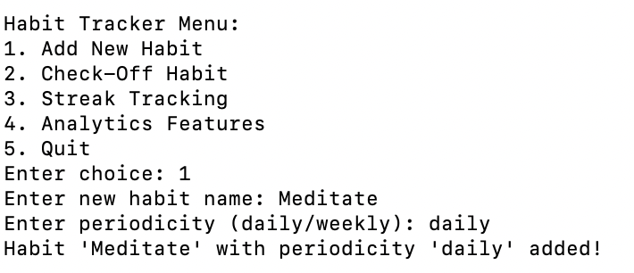

# Habit-Tracker

A simple app to help you track and analyze your habits!

## Features
- Add and manage daily or weekly habits.
- Track streaks and visualize performance.
- Analyze your most consistent and challenging habits.

## Tech Stack

- **Language**: Python
- **Database**: JSON
- **Testing**: Unittest
- **Environment**: Virtualenv


## Installation
1. Clone the repository:
   ```bash
   git clone https://github.com/zzunge/Habit-Tracker.git
   cd Habit-Tracker
   python3 -m venv venv
   source venv/bin/activate
   pip install -r requirements.txt
   python main.py

## Usage 
Once the program is running, you will see the **Habit Tracker Menu** like below:

### Main Menu

---

### Adding a New Habit
To **add a habit**, choose **option 1** and input the name and periodicity (daily or weekly). 

1. Choose `1` from the menu.
2. Enter a habit name (e.g., **"Meditate"**).
3. Specify the periodicity (e.g., **"daily"** or **"weekly"**).

<p align="center">
  
</p>

---

### Checking Off a Habit
To **mark a habit as complete**, choose **option 2** from the menu and input the habit name.

1. Choose `2` from the menu.
2. Enter the name of the habit (e.g., **"Meditate"**) to check it off.

<p align="center">
  
</p>


---

### Streak Tracking
To view your **current streaks**, choose **option 3** from the menu. You will see the list of habits and their respective streaks.
<p align="center">
  
</p>


---

### Analytics Features
To access **analytics**, choose **option 4**. The app will display:
- Your **longest streak**.
- The **most challenging habits** (habits you struggle to maintain).
- Lists of **daily** and **weekly habits**.
<p align="center">
  
</p>

---

### Quitting the Program
To **exit** the Habit Tracker, choose **option 5**. You will see a goodbye message, and the program will terminate.


## Testing

This project includes unit tests to verify the functionality of core features.
To run all unit tests, use the following command:

```bash
python -m unittest discover -s tests
```
## Data Structure
Habits and user data are stored in JSON format. Here's an example:
```json
{
  "username": "DefaultUser",
  "habits": [
    {
      "name": "Exercise",
      "periodicity": "daily",
      "creation_date": "2024-12-01",
      "completion_history": ["2024-12-01", "2024-12-02"],
      "current_streak": 2
    }
  ]
}
```


